# Landsat8 数据获取（以青海省为例）

## 行政边界下载

> 阿里云地图工具：[http://datav.aliyun.com/portal/school/atlas/area_selector](http://datav.aliyun.com/portal/school/atlas/area_selector)

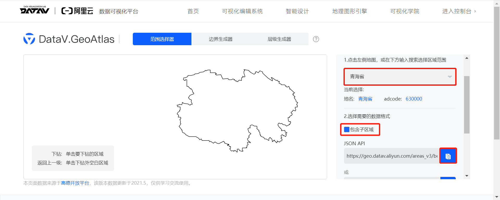

> 青海省行政边界：[https://geo.datav.aliyun.com/areas_v3/bound/630000.json](https://geo.datav.aliyun.com/areas_v3/bound/630000.json)

<details>
<summary>630000.json</summary>

```json
{
    "type": "FeatureCollection",
    "features": [
        {
            "type": "Feature",
            "properties": {
                "adcode": 630000,
                "name": "青海省",
                "center": [
                    101.778916,
                    36.623178
                ],
                "centroid": [
                    96.043533,
                    35.726403
                ],
                "childrenNum": 8,
                "level": "province",
                "acroutes": [
                    100000
                ],
                "parent": {
                    "adcode": 100000
                }
            },
            "geometry": {
                "type": "MultiPolygon",
                "coordinates": [
                    [
                        [
                            [
                                102.488496,
                                37.078562
                            ],
                            ...,
                            [
                                102.488496,
                                37.078562
                            ]
                        ]
                    ],
                    [
                        [
                            [
                                102.83891,
                                36.345754
                            ],
                            [
                                102.84793,
                                36.355619
                            ],
                            [
                                102.832077,
                                36.366612
                            ],
                            [
                                102.83891,
                                36.345754
                            ]
                        ]
                    ]
                ]
            }
        }
    ]
}
```

</details>

下载青海省行政边界后，用可视化工具 [mapshaper](https://mapshaper.org/) 打开，发现有两个多边形，且有两个交叉点：

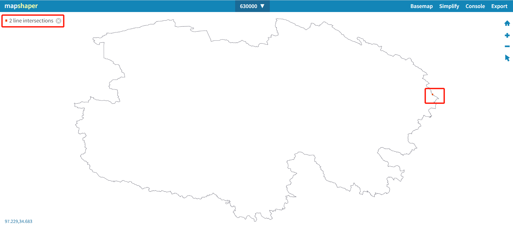

为了看清楚交叉点，我们将交叉点所在区域放大：

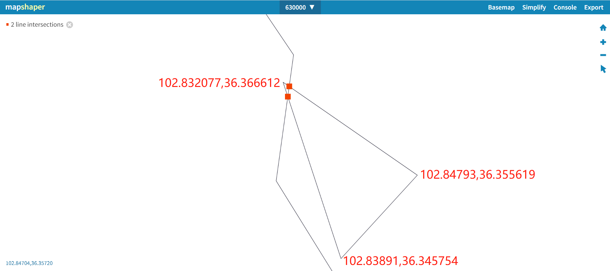

但从 [earthexplorer.usgs.gov](https://earthexplorer.usgs.gov/) 下载 Landsat8 数据时一次只允许指定一个多边形区域。

为简化处理，我们这里将青海省的小三角区域对应的多边形地理坐标删除，删除之后的 JSON 文件：[Qinghai_del.json](/json/Qinghai_del.json)。

## 多边形点限定

在 [earthexplorer.usgs.gov](https://earthexplorer.usgs.gov/) 中进行区域选择时，最大支持 500 个点的多边形，超过该限制会报错：

> Files are limited to one record containing one polygon or line string with a maximum of 500 points.

因此，先写个[脚本](/script/litmit.py)将青海省的行政边界简化到用 500 以内个点表示的多边形。简化之后的 JSON 文件：[Qinghai_lit.json](/json/Qinghai_lit.json)。

在同一个图层打开 [Qinghai_del.json](/json/Qinghai_del.json) 和 [Qinghai_lit.json](/json/Qinghai_lit.json)，对比结果如下：

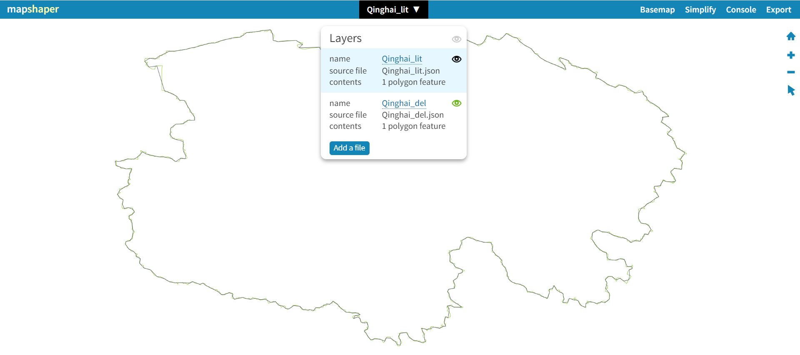

放大一局部区域进行查看：

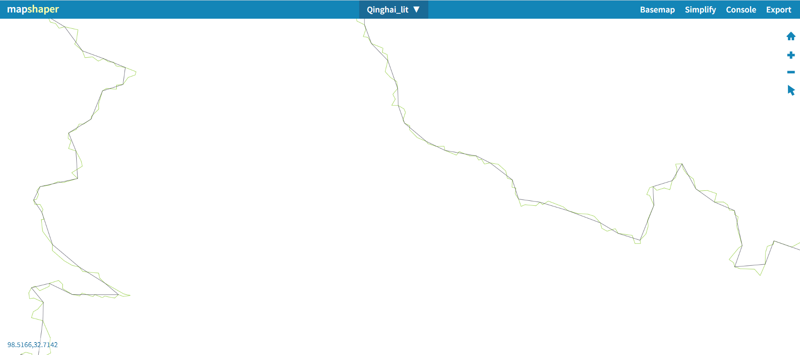

## 地理格式转换

在 [earthexplorer.usgs.gov](https://earthexplorer.usgs.gov/) 中进行区域选择时，仅支持上传 KML/KMZ 或 Shapefile 格式的多边形地理坐标文件。

因此，我们需要将上一步处理得到的 JSON 格式转换为 KML/KMZ 或 Shapefile 格式。

这里，找到了两个在线格式转换工具：

- [mapshaper.org](https://mapshaper.org/)：支持将 GeoJSON 格式转换为 Shapefile 格式
- [geojson.io](http://geojson.io/)：支持将 GeoJSON 格式转换为 KML 格式和 Shapefile 格式

geojson.io 支持的转换格式更多，所以我们这里就用它了。上传 [Qinghai_lit.json](/json/Qinghai_lit.json)，然后选择保存为 KML 格式。

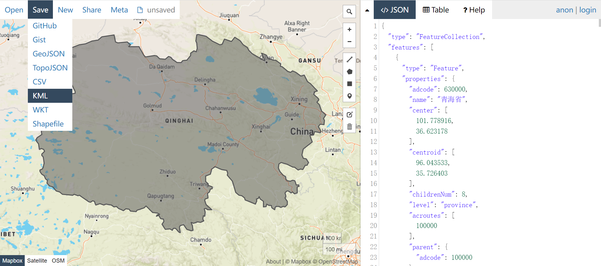

转换之后的 KML 格式的行政边界：[Qinghai.kml](/json/Qinghai.kml)

## 下载遥感数据

1. 进入网站 [earthexplorer.usgs.gov](https://earthexplorer.usgs.gov/)，并注册账号，然后登录

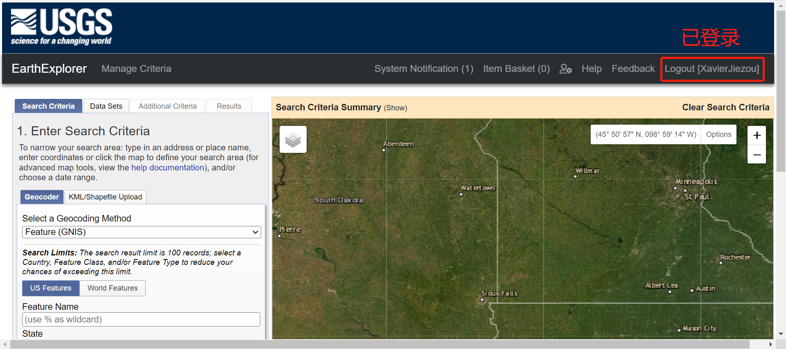

2. 选择一个地理区域（上传我们在上一步获取的 [Qinghai.kml](/json/Qinghai.kml) 文件）

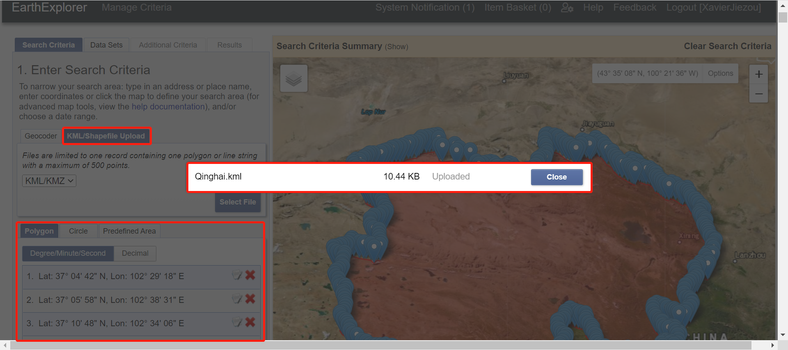

3. 日期范围和云量就不选了（默认所有），直接进入到下一步数据集的选择界面

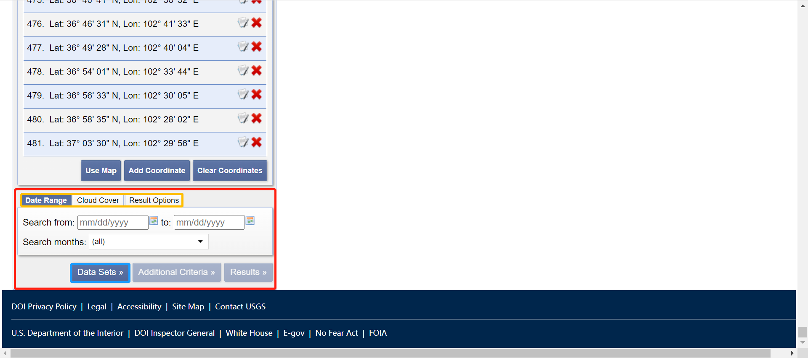

4. 选择 `Landsat Collection 2 Level-2` -> `Landsat 8-9`

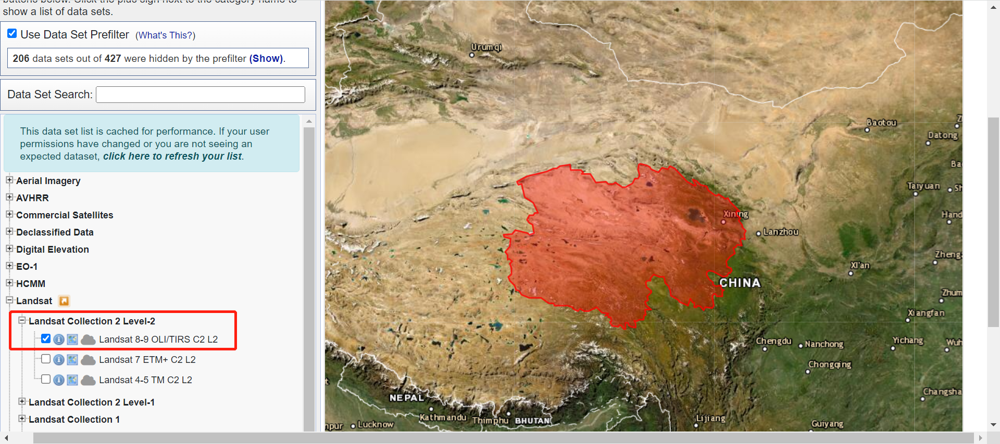

5. 下一步，添加额外的选项，这里限定 Satellite 为 8，即只搜索 Landsat 8 的产品

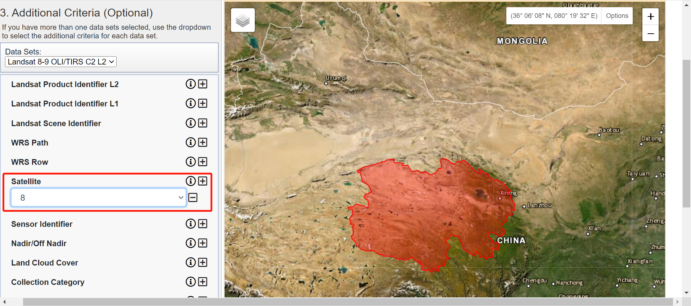

6. 共搜索到 10728 个结果，默认每页展示 10 张结果

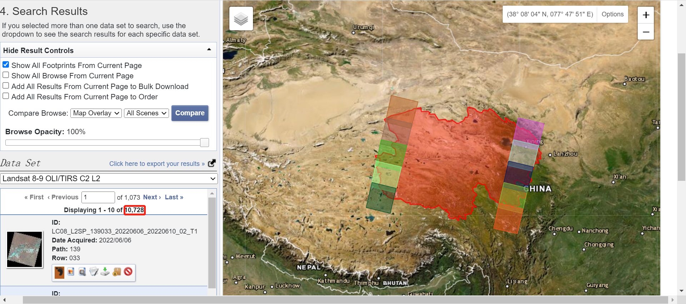

7. 每个搜索到的结果的各个详细信息如下：

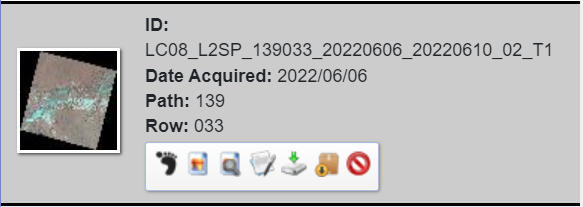

- ID：唯一编号（反映了拍摄卫星类型、拍摄时间、数据处理级别等信息）
- Date Acquired：数据获取时间
- Path：经度条带号
- Row：维度条带好
- 脚印按钮：在右边可视化界面显示该景图像对应位置
- 相册按钮：在右边可视化界面显示该景图像的缩影图
- 放大镜按钮：比较
- 编辑按钮：显示该景图像的元数据
- 下载按钮：下载该景图像到本地
- 订购按钮：添加到购物车以便批量下载
- 禁止按钮：将该景图像从搜索结果中移除
